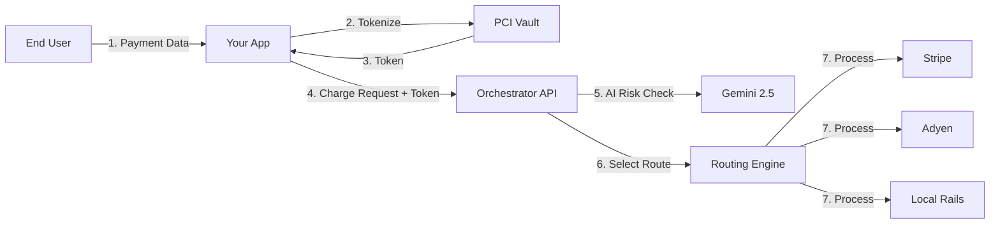

# Orchestrator Prime 🌐💳

> **The Financial Operating System for Global Commerce.**


**Orchestrator Prime** is a high-performance payment orchestration platform designed for enterprise merchants. It acts as a unified abstraction layer over the fragmented world of global payments, allowing businesses to integrate once and access any payment provider, method, or bank globally.

---

## 🧐 What is the Product?

In the modern financial landscape, merchants often struggle with:
*   **Vendor Lock-in**: Being tied to a single processor (e.g., Stripe) leads to higher fees and single points of failure.
*   **Fragmented Integrations**: Supporting local payment methods (like BI-FAST in Indonesia or PayNow in Singapore) usually requires separate, complex integrations.
*   **Compliance Burden**: Handling raw credit card data increases PCI-DSS scope.

**Orchestrator Prime solves this by providing:**
1.  **A Single API**: One standardized JSON format for all transactions, regardless of the underlying provider.
2.  **Smart Routing**: An engine that dynamically routes transactions to the cheapest or most reliable provider in real-time.
3.  **Zero-Trust Vault**: A secure environment that handles sensitive data so you don't have to.

## ⚙️ How It Works

The platform operates as a middleware service in your payment stack.



### The Flow:

1.  **Tokenization**: The client SDK sends raw card data directly to our **Rust-based Vault**. The vault returns a safe, non-sensitive token (`tok_...`).
2.  **Ingestion**: Your backend sends a charge request with the token to the Orchestrator API.
3.  **Intelligence**: The **Gemini 2.5 Flash** model analyzes the transaction context (IP, device, velocity) to assign a fraud probability score.
4.  **Routing Decision**: The Smart Router evaluates rules (e.g., *"If currency is USD and type is Debit, use TabaPay"*).
5.  **Execution**: The request is transformed into the specific format required by the selected provider (e.g., ISO 8583 for Chase, JSON for Stripe) and sent upstream.
6.  **Normalization**: The provider's response is normalized into a standard `200 OK` or `402 Failed` and returned to your app.

## 🌟 Key Features

### 🧠 AI-Driven Smart Routing
Stop losing 3-5% of revenue to false declines. Our engine uses Gemini AI to analyze 50+ data points and select the acquirer with the highest probability of authorization.

### 🛡️ Zero-Trust Vault
Reduce your PCI scope to **SAQ A**. We store the PANs (Primary Account Numbers) in a dedicated, isolated environment. You only ever handle tokens.

### 🌏 Global Local Rails
Native support for Southeast Asian real-time payments:
*   **Indonesia**: QRIS, BI-FAST, Mandiri/BCA Virtual Accounts.
*   **Singapore**: PayNow, FAST.
*   **Malaysia**: DuitNow.

### 💳 Virtual Issuing
Programmatically issue virtual cards for operational expenses. Set strict spend limits, merchant category restrictions, and expiry dates via API.

## 💻 Configuration Example

Define routing logic using our simple JSON-based rule engine:

```json
{
  "rules": [
    {
      "name": "Optimize US Debit",
      "condition": "card.type == 'DEBIT' && transaction.currency == 'USD'",
      "action": {
        "provider": "tabapay",
        "fallback": "stripe"
      }
    },
    {
      "name": "High Value Euro",
      "condition": "transaction.amount > 1000 && transaction.currency == 'EUR'",
      "action": {
        "provider": "adyen_eu_mid",
        "fallback": "checkout_com"
      }
    }
  ]
}
```

## 🛠 Tech Stack

*   **Frontend**: React 19, TypeScript, Tailwind CSS, Lucide React, Recharts
*   **Backend Simulation**: Go (Orchestration), Rust (Vault), Node.js (Edge Functions)
*   **AI**: Google GenAI SDK (`@google/genai`)
*   **Database**: CockroachDB (Geo-Partitioned SQL)

## 🚀 Getting Started

```bash
# Clone the repository
git clone https://github.com/your-org/orchestrator-prime.git

# Install dependencies
npm install

# Set up environment variables
cp .env.example .env
# Add your Google Gemini API Key

# Start the development server
npm start
```

## 🔒 Security & Compliance

*   **PCI-DSS Level 1**: Validated Service Provider.
*   **Data Sovereignty**: User data is pinned to specific geographic regions using database partitioning to comply with GDPR, RBI, and OJK regulations.

---

© 2024 Orchestrator Prime. Built for scale.
